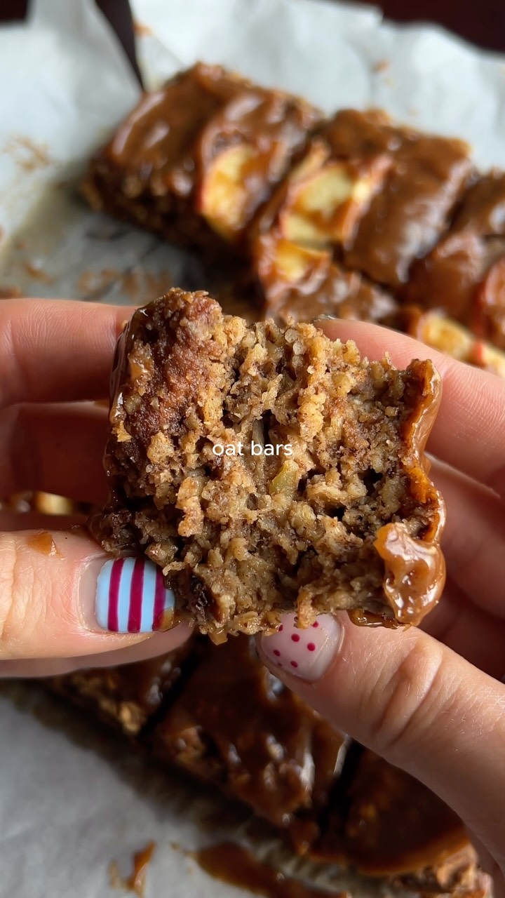

# Apple Almond Caramel Oat Bars

An autumn snack made with apple, almond butter, oats, and a simple caramel topping.

Source: [Facebook reel](https://www.facebook.com/61564237352202/videos/let-the-autumn-recipes-begin-these-are-sooo-yummy-and-i-wish-you-could-try-them-/4070055086632946/)

## Ingredients

### Oat bars

- 160 g oats
- 120 g grated apple, squeezed to remove excess juice
- 60 g almond butter
- 1 tsp bicarbonate of soda
- 2 flax eggs (15 g ground flax seeds soaked in 20 ml water)
- 50 ml syrup of choice
- 2 tsp cinnamon
- a generous pinch of salt
- 30 g chopped walnuts
- 220 ml milk of choice
- sliced apples for the top

### Caramel topping

- 60 g almond butter
- 20 ml maple syrup
- a tiny pinch of salt
- 20 ml milk

## Method

1. Preheat the oven to **180°C / 350°F**.
2. Combine all oat-bar ingredients in a bowl.
3. Tip the mixture into a lined square baking dish and add sliced apples on top.
4. Bake for **25–35 minutes**, until golden brown.
5. Let cool for **10–15 minutes**.
6. Make the caramel by mixing the topping ingredients, then spread it over the bars.
7. Cut into squares and serve.
