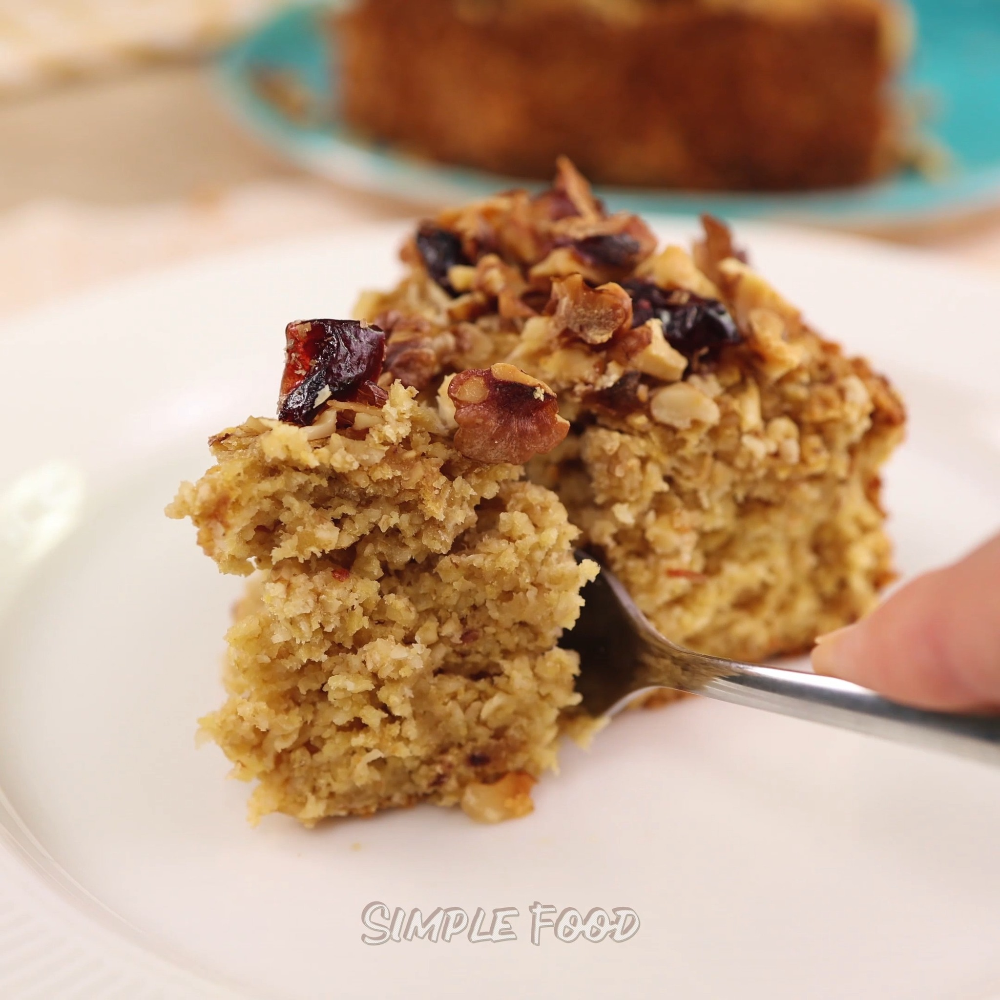

# Oatmeal Apple Pie

A flour-free, white-sugar-free, and butter-free apple pie made with oatmeal and apples.

Source: [Facebook video](https://www.facebook.com/simplefoodvideoo/videos/no-flour-white-sugar-or-butter-only-oatmeal-and-apples-an-apple-pie-that-melts-i/3050032069190463/)

## Ingredients

The reel's public description says the recipe uses only oatmeal and apples. The exact quantities and full method are spoken in the video and were not included in the public description, so they are not guessed here.

## Method

Blend two apples, mix with the eggs and oat flour, then bake in a lined baking dish until set and golden. The original reel uses a standard baked-apple-dessert method; exact baking time and temperature were not specified manually.

> Note: the ingredient quantities are from the user; the baking temperature and time remain unspecified.

## Source

Original link supplied: [Facebook share link](https://www.facebook.com/share/v/1HeYcfLMmY/)
  
Direct video URL: [Simple Food video](https://www.facebook.com/simplefoodvideoo/videos/no-flour-white-sugar-or-butter-only-oatmeal-and-apples-an-apple-pie-that-melts-i/3050032069190463/)

  
  