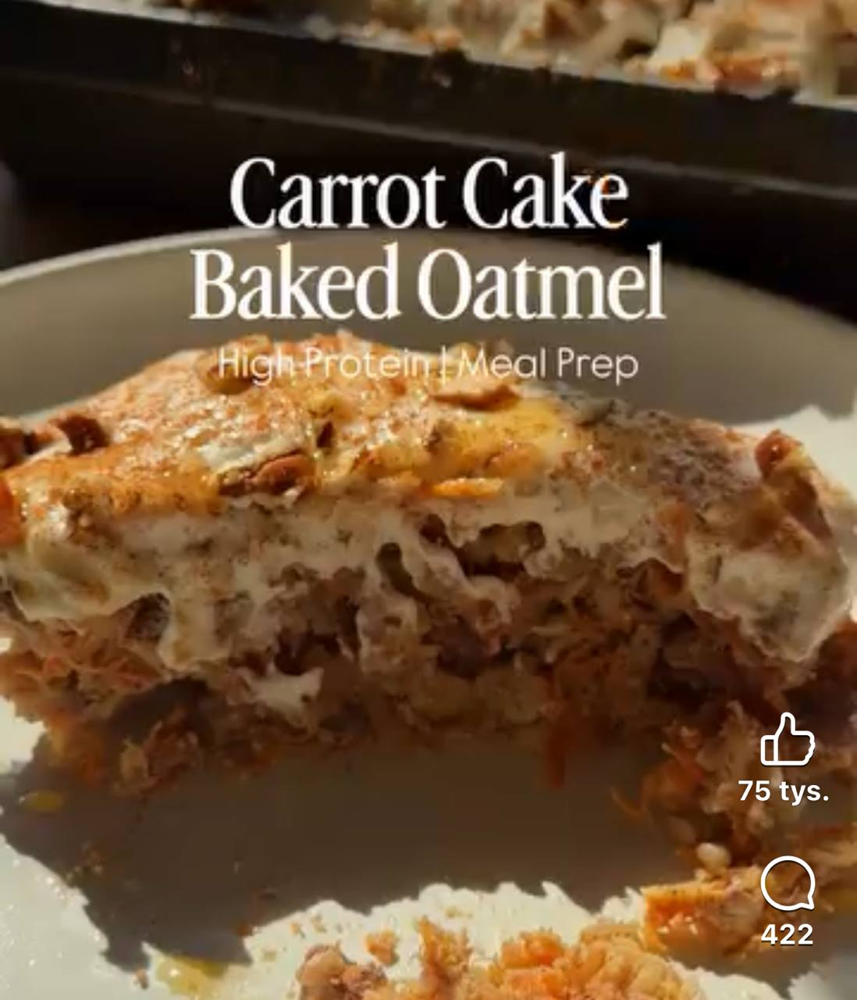

# Carrot Cake Baked Oats

Źródło: [rolka na Facebooku](https://www.facebook.com/share/r/1DtVDhQDAX/)

## Składniki

### Baked oats

- 2–3 dojrzałe banany, rozgniecione
- 2 jajka
- ¾ szklanki mleka
- ½ szklanki jogurtu greckiego
- 2 szklanki płatków owsianych
- 2 miarki waniliowej odżywki białkowej
- 1 szklanka startej marchewki
- ½ szklanki posiekanych pekanów lub orzechów włoskich
- 2 łyżki miodu lub syropu klonowego
- 1 łyżeczka cynamonu
- ¼ łyżeczki imbiru
- ¼ łyżeczki gałki muszkatołowej
- 1 łyżeczka proszku do pieczenia
- szczypta soli

### Topping

- 1 szklanka serka cottage cheese
- 2 łyżki jogurtu greckiego
- 2 łyżki miodu
- odrobina wanilii
- cynamon

## Przygotowanie

1. Zblenduj składniki na topping na gładką masę. Możesz przechowywać go osobno.
2. Wymieszaj wszystkie składniki baked oats w naczyniu o wymiarach 8 × 8 cali.
3. Piecz w temperaturze **350°F / 175°C** przez **30–35 minut**.
4. Ostudź, posmaruj toppingiem i pokrój na 4 porcje.
