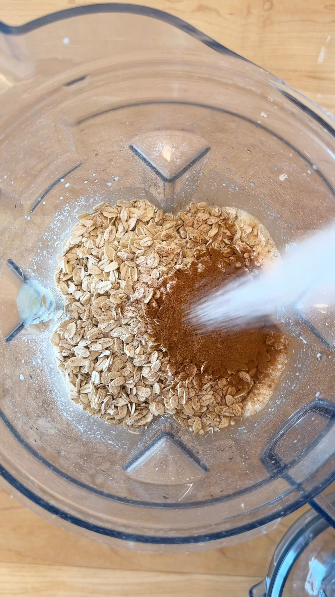

# Carrot Cake Breakfast Baked Oatmeal

A meal-prep baked oatmeal with 11 g protein per serving, no protein powder, and 4 g fiber.

Source: [Facebook reel](https://www.facebook.com/lindsaypleskotrd/videos/carrot-cake-for-breakfast-with-11g-protein-no-protein-powder-and-4g-fiber-does-it-get-any-better-i/38039968028927698/)

## Ingredients

- 1 cup milk
- ⅔ cup unsweetened applesauce
- 3 large eggs
- 2 tbsp maple syrup
- 2 tbsp olive oil
- 2 tsp vanilla extract
- 2½ cups rolled oats
- 2 tsp cinnamon
- 2 tsp baking powder
- 1 tsp baking soda
- ¾ tsp salt
- 1½ cups lightly packed shredded carrots (no need to peel)
- ½ cup raisins
- 1 serving Greek Yogurt Cream Cheese Frosting

## Method

1. Mix the ingredients according to the original reel and bake until set and golden. The public description does not include the oven temperature, baking time, or full method, so those details are not guessed here.
2. Cool, add the Greek Yogurt Cream Cheese Frosting, and portion for breakfast meal prep.

## Notes

- The creator describes this as a family-friendly breakfast that takes about 20 minutes of prep.
- The public description claims 11 g protein and 4 g fiber per serving.
- Frosting ingredients are not included in the public description.
