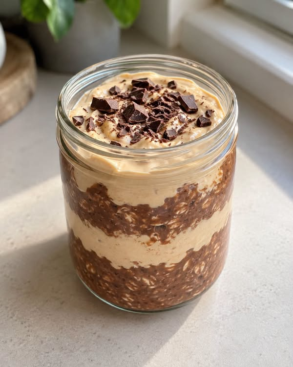

# Chocolate Peanut Butter Overnight Oats

A creamy chocolate overnight-oats base with peanut butter and pieces of dark chocolate. The oats soften overnight and become thick and creamy.

Source: [Facebook post](https://www.facebook.com/61574825356928/posts/nocna-owsianka-czekoladowa-z-mas%C5%82em-orzechowym-%EF%B8%8Fintensywnie-kakaowa-baza-krem-or/122189997788827511/)

## Ingredients — 1 serving

- 40 g rolled oats
- 200 g plain skyr
- 90 ml unsweetened oat drink
- 20 g 100% peanut butter
- 8 g cocoa powder
- 10 g dark chocolate
- 10 g honey (or erythritol, to taste)
- A pinch of salt

## Method

1. Put the cocoa powder in a bowl. Add 30 ml of the oat drink and stir into a smooth paste.
2. Add 130 g of the skyr, the honey and salt, followed by another 50 ml of the oat drink.
3. Stir well, then add the oats. Mix again and leave for 10 minutes.
4. In a separate bowl, combine the remaining 70 g of skyr, the peanut butter and the remaining 10 ml of oat drink to make a smooth cream.
5. Finely chop the dark chocolate. Stir half of it into the chocolate-oat mixture and reserve the rest for topping.
6. In a 450–500 ml jar, layer half of the oat mixture and half of the peanut-butter cream. Repeat the layers.
7. Close the jar and refrigerate for 8–12 hours.
8. Sprinkle with the remaining chocolate just before serving. Eat both layers together.
