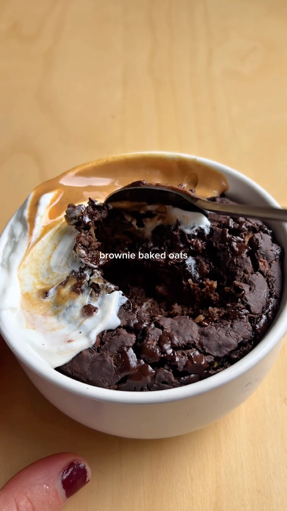

# Courgette Chocolate Brownie Oats

A fudgy baked-oats brownie made with grated courgette.

Source: [Facebook reel](https://www.facebook.com/watch/?ref=saved&v=1340839834185136)

## Ingredients

- 50 g oat flour (or oats blended into flour)
- 80 g grated courgette
- 30 g chocolate vegan protein powder
- 5–10 g cocoa powder
- ½ tsp baking powder
- 170 ml water or milk
- Chocolate for the top

### Optional topping

- Greek yogurt
- Peanut butter

## Method

1. Preheat the oven to **180°C**.
2. Mix all ingredients together.
3. Pour the mixture into an oven-safe ramekin and top with chocolate chips or pieces.
4. Bake for **20–25 minutes**.
5. Top with Greek yogurt and peanut butter, if using.

*The original reel credits Prozis for the starred ingredients and mentions a discount code; the recipe itself does not depend on that brand.*
