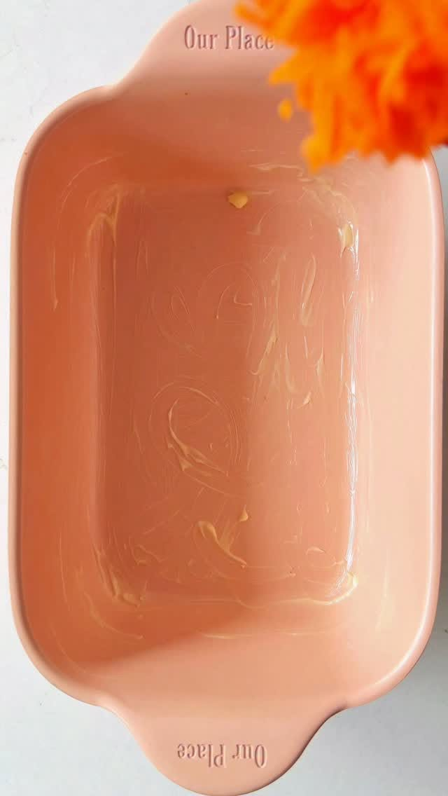

# Single-Serve Apple Pie

A simple single-serving, no-knead apple crumble-style pie.

Source: [Facebook reel](https://www.facebook.com/100086522696291/videos/jednoporcjowa-szarlotka-sypana7-minut-przygotowania-i-taka-ca%C5%82a-szarlotka-ma-tyl/1520665283354342/)

## Ingredients

- 25 g ground oats
- 25 g semolina
- 25 g erythritol
- 1 tsp baking powder
- 2 apples (about 300 g after grating)
- ½–1 tsp cinnamon
- 10 g butter
- 150 ml water

## Method

1. Mix the ground oats, semolina, 10 g erythritol, and baking powder.
2. Peel and grate the apples. Put them in a pan with the cinnamon, remaining 15 g erythritol, and 150 ml water.
3. Simmer over medium heat for about 5 minutes. Do not drain the apples; the liquid moistens the dry layers.
4. Divide the dry ingredients into 3 portions and the apples with their liquid into 2 portions.
5. Layer: one third of the dry mixture, half the apples and liquid, one third of the dry mixture, the remaining apples and liquid, then the final third of the dry mixture.
6. Grate the cold butter over the top.
7. Bake at **180°C / 350°F for about 30 minutes**, until golden. Alternatively, air-fry at **180°C for about 20–25 minutes**.

## Nutrition

The original reel lists approximately **398 kcal**, **6.8 g protein**, **11.4 g fat**, and **68.1 g carbohydrates** for the whole serving.
