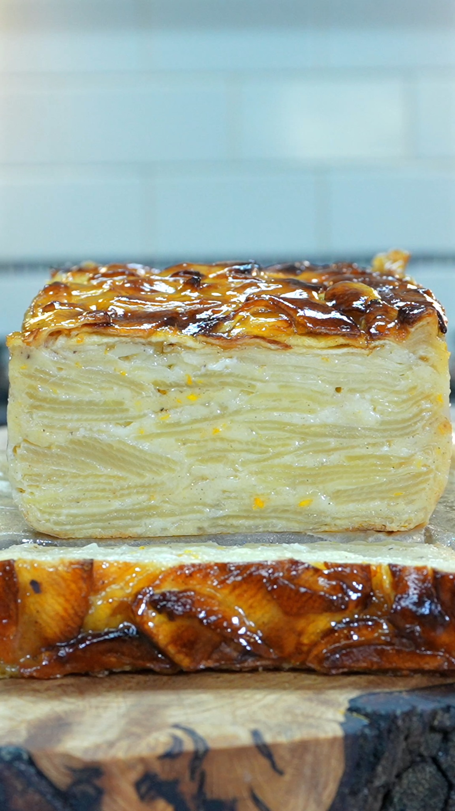

# Thousand-Layer Apple Cake

Also called an invisible apple cake: thin layers of apple bound by a delicate batter.

Source: [Facebook reel](https://www.facebook.com/pinchofmint/videos/thousand-layer-apple-cake-recipe-applecake-recipe-cake/1051595737721752/)

## Ingredients

- 6–8 apples
- Zest and juice of 1 orange
- Eggs
- Caster sugar
- Melted butter
- Milk
- Vanilla
- Cinnamon
- Nutmeg
- Flour
- Warm apricot jam, for brushing
- Icing sugar, for dusting

## Method

1. Peel and core the apples, then slice them very thinly, about 1–2 mm thick.
2. Add the orange zest and juice and mix so every apple slice is coated.
3. Whisk the eggs and caster sugar until pale and smooth.
4. Add melted butter, milk, vanilla, cinnamon and nutmeg. Whisk again, then add the flour and mix until just combined. The batter will be very thin.
5. Pour the batter over the apples and mix thoroughly so every slice is coated.
6. Line a loaf tin with parchment paper, leaving an overhang for easy lifting. Transfer the apples to the tin, layering or pressing them in, and pack them tightly.
7. Pour over any remaining batter.
8. Bake at **170°C for about 1 hour**. Loosely cover with foil if it browns too quickly.
9. Cool for 15 minutes, brush with warm apricot jam, then cool completely before lifting out.
10. Slice, dust with icing sugar and serve warm or at room temperature.

## Note

The video clearly gives the apple quantity, slice thickness, temperature and timing, but does not show exact quantities for the batter ingredients. I have left those amounts unspecified rather than guessing.
